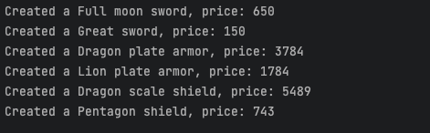

Open/Closed Principle(OCP)
Bertrand Meyer, the person who first wrote the term open/closed principle in 1988, says that:
"Sofware entities (classes, modules, functions, and so on) should be open for extension but closed for modification."
So, you should be capable of modifying the class behaviors externally without modifying the code itself. The most effective approach to achieve this is by constructing the application with numerous well-crafted code units, connected through dependency injection.

In this particular example, the primary goal is to effectively illustrate the Open/Closed Principle. To achieve this, a Metin2 item factory has been developed. The example thoughtfully integrates an IItemFactory interface, purposefully designed to enable the creation of new item types in a modular and scalable fashion. In this specific implementation, the focus is on creating swords, armors, and shields.

The true power of the Open/Closed Principle, however, lies in its flexibility and adaptability. This allows for the seamless addition of new item types as necessary. For instance, expanding the range of items in this factory to encompass helmets or boots could be accomplished with ease. The well-structured nature of the code, adhering to the Open/Closed Principle, ensures that the item factory remains both maintainable and extensible.

By applying the Open/Closed Principle in this example, it is possible not only to demonstrate its practical utility but also to showcase its potential to enhance the overall design of software systems. This principle encourages developers to produce code that is simultaneously robust and flexible, empowering them to readily adapt to shifting requirements and evolving needs.

