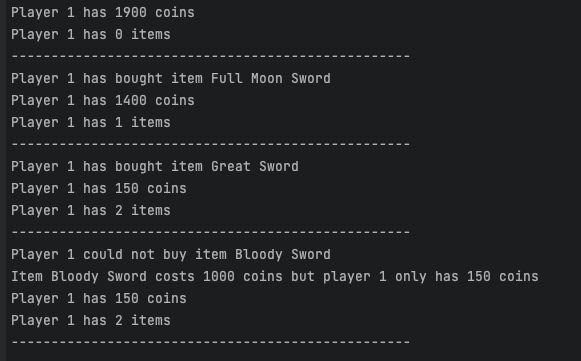

Single Responsibility Principle

The SRP means that a single class should have a single responsibility. 
This means that a class should have only one reason to change.

There is a quote from Robert C. Martin(Originator of the single responsibility principle) that says:
"There should be never more than one reason for a class to change."

Why that principle exists?
- To make our classes more reusable and create more flexible and maintainable code.
- To make our code more readable and understandable. Fewer responsibilities mean fewer dependencies. 
- To make our code more testable. 

In this example, I created a simple simulation of the item buying and selling mechanism in the Metin2 game using the Single Responsibility Principle (SRP). There are three different classes here: 
1- Item: Represents the item objects in the game. 
2- ItemShop: Manages the buying and selling of items. 
3- Database: Handles data management.

